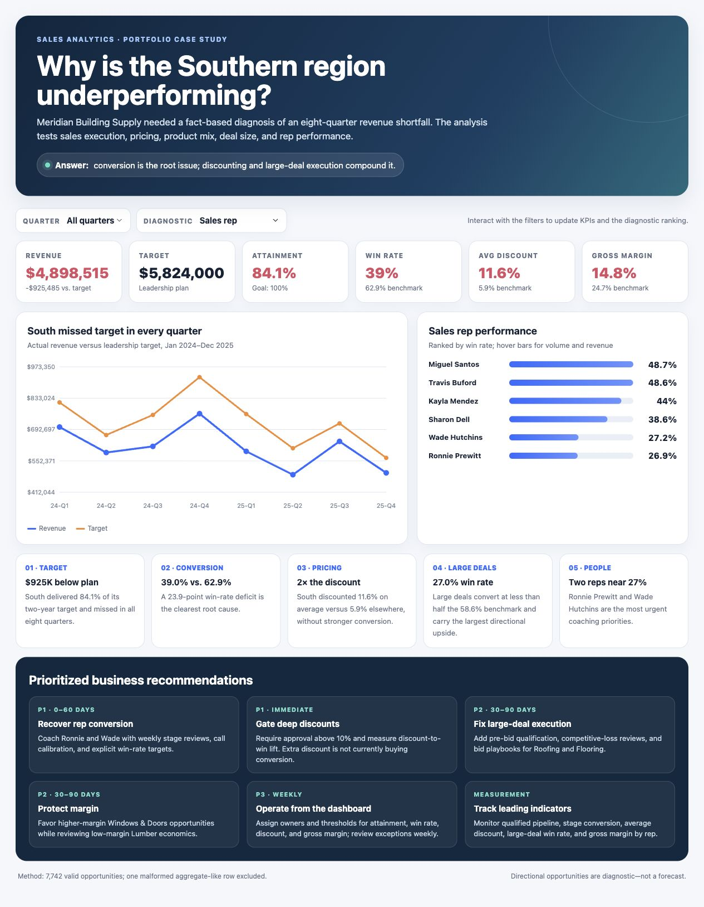
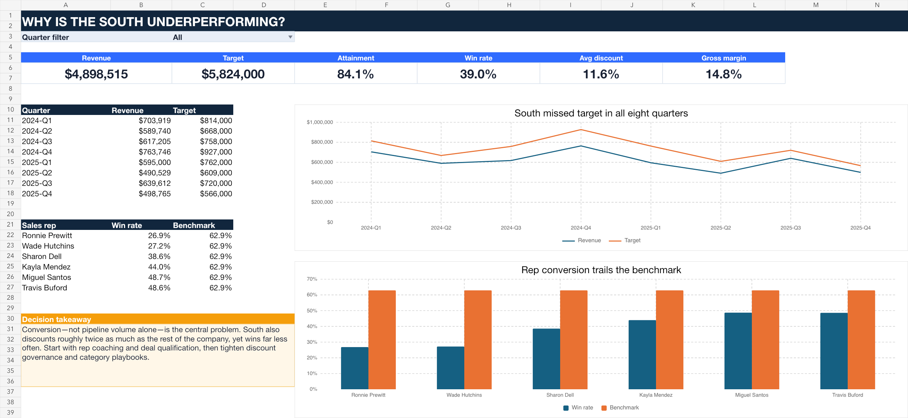

# Meridian Building Supply — Southern Region Sales Diagnostic

## Business problem

The Southern region consistently missed quarterly revenue targets. Leadership needed to determine whether the shortfall was caused by product mix, pricing, or sales-team execution—and decide what to fix first.



## Data cleaning and validation

- Profiled 7,743 raw transaction rows and removed one malformed aggregate-like footer row with blank identifiers and extreme numeric values.
- Retained 7,742 valid opportunities with unique order IDs and no missing cells.
- Validated region and deal-status domains, discount bounds, date-to-quarter alignment, deal-value arithmetic, net-price rounding, revenue/cost rules, and gross-profit arithmetic.
- Reconciled transaction revenue to all 40 region-quarter target records within $0.01.
- Preserved the raw workbook; analysis uses an explicit `order_id IS NOT NULL` cleaning rule.

## Methodology

1. Built regional and quarterly scorecards for attainment, win rate, discount, deal value, and gross margin.
2. Benchmarked South against all non-South opportunities.
3. Drilled into sales rep, product category, customer type, and deal size.
4. Estimated directional upside by holding South opportunity volume and deal economics constant while applying benchmark win rates. These scenarios are diagnostics, not forecasts.

## Key findings

1. **Persistent target miss:** South generated **$4.90M** against a **$5.82M** target—**84.1% attainment** and a **$925K shortfall** across all eight quarters.
2. **Conversion is the root issue:** South’s win rate was **39.0%**, versus **62.9%** in other regions, a **23.9-point gap**.
3. **Pricing compounds the problem:** South discounted **11.6%** on average versus **5.9%** elsewhere, yet converted less; gross margin was **14.8%** versus **24.7%**.
4. **Large deals and Flooring are critical breakdowns:** Large-deal win rate was **27.0%** versus **58.6%**; Flooring converted only **20.0%** versus **60.6%** outside South.
5. **Rep performance is concentrated:** Ronnie Prewitt and Wade Hutchins posted the lowest win rates at **26.9%** and **27.2%**, making them the first coaching priorities.

## Prioritized recommendations

1. **P1 — Recover rep conversion (0–60 days):** weekly stage reviews, call coaching, and explicit conversion targets for Ronnie and Wade.
2. **P1 — Gate deep discounts (immediate):** require approval above 10% and measure discount-to-win lift by rep and segment.
3. **P2 — Fix large-deal execution (30–90 days):** add pre-bid qualification and competitive-loss reviews; build Roofing and Flooring bid playbooks.
4. **P2 — Protect margin:** favor higher-margin Windows & Doors opportunities while reviewing low-margin Lumber economics.
5. **P3 — Establish a weekly operating cadence:** assign owners and thresholds for attainment, win rate, discount, large-deal conversion, and gross margin.

## Deliverables

- `dashboard/index.html` — self-contained interactive dashboard with quarter and diagnostic filters.
- `meridian_sales_performance_portfolio.xlsx` — auditable Excel dashboard, supporting analysis, validation log, clean data, and target inputs.
- `sql/analysis.sql` — cleaning, validation, regional scorecard, quarterly trend, rep/category diagnostics, and large-deal loss queue.
- `src/analysis.py` — reproducible cleaning, validation, benchmarking, and export workflow.
- `data/clean_data.csv` and `data/regional_targets.csv` — analysis-ready datasets.



## Run locally

Open `dashboard/index.html` directly in a modern browser. To rerun the Python analysis from the project root:

```bash
python src/analysis.py --source path/to/meridian_raw_data.xlsx --output analysis_output
```

The company and data are fictional and intended for portfolio demonstration.
